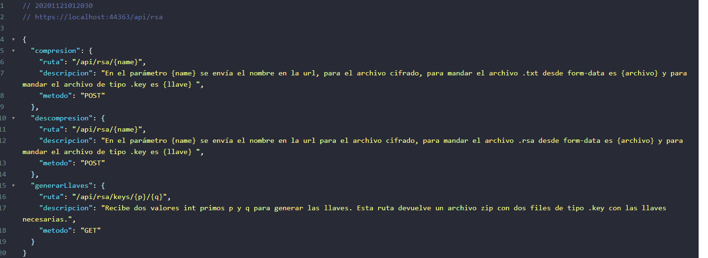

# LAB7-RSA
API en .net core y libreria de clases que cifran utilizando RSA. Laboratorio de Cifrado de estructura de datos 2

# Descripcion API
Para saber mas informacion del uso de la API, en la ruta "/" existe una pequeña descripcion sobre cada endpoint.

